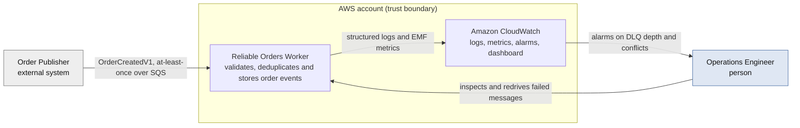
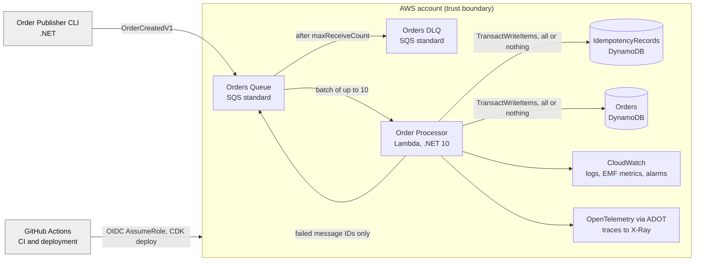

# Architecture

## System Diagram

Two views, following C4 levels 1 and 2.

Level 3 is deliberately absent. [Application Components](#application-components) already specifies
every component with its interface and responsibilities, in more detail than a component diagram
would carry.

These render in the GitHub file view. They do not render in a pull request diff, which shows raw
markdown, so review the rendered file rather than the diff when a diagram changes.

### Context



The trust boundary is the AWS account. The publisher sits outside it and is not trusted, which is
why every field is validated and every payload size is bounded. The operations engineer is the only
human in the loop, and reaches the system through alarms rather than by watching it.

### Containers



The two DynamoDB tables are written by one transaction, which is the whole design. The edge from
the Lambda back to the queue carries failed message IDs only, and the edge from the queue to the
DLQ fires after `maxReceiveCount` is exhausted.

## Application Components

### Transport-Neutral Message Input

The core project must not reference AWS types. `ReliableOrders.Core` therefore defines its own
inbound message shape, and the Lambda project maps `SQSEvent.SQSMessage` onto it.

```csharp
public sealed record IncomingMessage(
    string MessageId,
    string Body,
    int ApproximateReceiveCount,
    IReadOnlyDictionary<string, string> Attributes);
```

Specification v1 placed `SQSEvent.SQSMessage` on `IOrderMessageProcessor`, which contradicted both
the layering rule in the [Repository Structure](#repository-structure) section and the architecture
test in the Optional
Quality Tests section.

The type enforces its own invariants rather than leaving them to the mapper. A blank `MessageId`, a
delivery count below the first delivery, and a missing attribute set are all rejected at
construction. A shape checked only where SQS records are mapped holds for records that arrived from
SQS and for nothing else, and every other producer — a quarantine replay, a fixture, a second
transport — reaches the processor through this constructor. `Attributes` is the one whose absence
costs the most: the transport starts a record's span from it before the per-record `try` opens, so a
null there fails the invocation and redelivers the whole batch rather than becoming one record's
failure. A message carrying no attributes says so with an empty set. `Body` is the one value with a
stated fallback instead of a check — an absent body and an empty one are the same thing to the
parser.

### `OrderEventParser`

#### Responsibilities

- Reject null or blank message bodies.
- Deserialize with source-generated `System.Text.Json`.
- Reject malformed JSON.
- Reject unsupported schema versions.
- Return a typed `OrderCreatedV1` envelope.
- Never log the complete raw message body.

```csharp
public interface IOrderEventParser
{
    ParseResult Parse(string? messageBody);
}

public abstract record ParseResult
{
    private protected ParseResult() { }

    public abstract TResult Match<TResult>(
        Func<Parsed, TResult> whenParsed,
        Func<Malformed, TResult> whenMalformed,
        Func<UnsupportedSchemaVersion, TResult> whenUnsupportedSchemaVersion);

    public sealed record Parsed(OrderCreatedV1 Event) : ParseResult;
    public sealed record Malformed(string Reason) : ParseResult;
    public sealed record UnsupportedSchemaVersion(int SchemaVersion) : ParseResult;
}
```

`Reason` must be a stable, body-free description suitable for logging.

`messageBody` is nullable because the SQS record it comes from can carry a null body.

### `OrderEventValidator`

#### Responsibilities

- Validate envelope metadata.
- Validate order identifiers and length limits.
- Validate currency format.
- Validate positive minor-unit amount.
- Validate item description.
- Validate UTC offset and the skew window (see [Contract Rules](event-contract.md#contract-rules)).
- Return structured validation failures.

```csharp
public sealed record ValidationFailure(string Field, string Rule);

public sealed record ValidationResult(IReadOnlyList<ValidationFailure> Failures)
{
    public bool IsValid => Failures.Count == 0;
}
```

Keep transport parsing and domain validation separate.

### `CanonicalPayloadHasher`

#### Responsibilities

- Map an event into a canonical representation.
- Serialize deterministically.
- Produce both SHA-256 hashes from one traversal, so envelope and business canonicalisation cannot
  drift.
- Be deterministic across machines and repeated executions.

```csharp
public sealed record PayloadHashes(string EnvelopeSha256, string BusinessSha256);

public interface IPayloadHasher
{
    PayloadHashes ComputeHashes(OrderCreatedV1 message);
}
```

### `IOrderCommandStore`

This interface owns the atomic persistence operation.

```csharp
public interface IOrderCommandStore
{
    Task<OrderWriteResult> TryCreateAsync(
        OrderCreatedV1 message,
        PayloadHashes hashes,
        CancellationToken cancellationToken);
}
```

#### Possible results

```csharp
public abstract record OrderWriteResult
{
    private protected OrderWriteResult() { }

    public abstract TResult Match<TResult>(
        Func<Created, TResult> whenCreated,
        Func<Duplicate, TResult> whenDuplicate,
        Func<Conflict, TResult> whenConflict,
        Func<TransientFault, TResult> whenTransientFault,
        Func<PermanentFault, TResult> whenPermanentFault);

    public sealed record Created : OrderWriteResult;
    public sealed record Duplicate(DuplicateScope Scope) : OrderWriteResult;
    public sealed record Conflict(ConflictScope Scope, string Reason) : OrderWriteResult;
    public sealed record TransientFault(string Reason) : OrderWriteResult;
    public sealed record PermanentFault(string Reason) : OrderWriteResult;
}

public enum DuplicateScope { Event, Order }
public enum ConflictScope { Event, Order, TokenMismatch }
```

`PermanentFault` carries the `ValidationError` and `ItemCollectionSizeLimitExceeded` cancellation
reasons that the [Error Classification](correctness-model.md#error-classification) table maps to a
permanent failure. Earlier revisions of this section listed four cases, which left the store no way
to express them — mapping them to `Conflict` would alarm as though a publisher had sent contradictory
data, and mapping them to `TransientFault` would burn the message's receive attempts on a request
that fails identically every time. Both are defects in this service rather than in any publisher.

`Reason` on every case is a value from `WriteFailureReason`, not an SDK exception message. Those carry
request identifiers, table names and item contents, which would make the reason useless as a metric
dimension and put stored order data in the logs.

### Exhaustiveness

Every result hierarchy in this design exposes a `Match` method.

The `private protected` constructor stops anything outside the defining assembly adding a case. It
does **not** make a `switch` exhaustive. C# has no closed hierarchies: a switch expression covering
every case with no discard arm still fails to compile with CS8509, and warnings are errors here, so
that is a build failure.

`Match` provides the guarantee instead. Each case is a parameter, so adding one breaks every call
site at compile time and no site can fall through to a default. Use it for classification results,
where missing a case is a correctness bug.

Specification v1 claimed the constructor alone let consumers "switch exhaustively without a defensive
default arm". It does not, and following it would have put a default arm in every consumer.

Note the absence of a `now` parameter. Specification v1 passed `DateTimeOffset now` into this
method. The determinism rule requires every persisted value to derive from the event, so accepting a
clock here would invite the determinism bug back in.

The interface must not expose separate `TryMarkAsync` and `SaveAsync` calls, because doing so makes
it easy to reintroduce the unsafe two-write sequence.

### `DynamoDbOrderCommandStore`

#### Responsibilities

- Build a two-item `TransactWriteItems` request, with index 0 the idempotency put and index 1 the
  order put.
- Use conditional puts (`attribute_not_exists`) on both items.
- Set `ReturnValuesOnConditionCheckFailure = ALL_OLD` on both puts.
- Set `ClientRequestToken` to the `eventId` verbatim.
- Guarantee request-body determinism per the [Transaction Requests Must Be
  Deterministic](correctness-model.md#transaction-requests-must-be-deterministic) section,
  writing no wall-clock values.
- Classify `TransactionCanceledException` from `CancellationReasons` per the Duplicate and Conflict
  Classification table, without a follow-up read. Implemented by `TransactionCancellationClassifier`,
  which takes no DynamoDB client, so the follow-up read cannot be reintroduced without widening its
  signature.
- Map `IdempotentParameterMismatchException` to `Conflict(ConflictScope.TokenMismatch, …)`.
- Treat `ConditionalCheckFailed` with a null `Item` as `TransientFault`.
- Preserve cancellation — never convert `OperationCanceledException` into a transient fault.
- Avoid logging entire DynamoDB items.

### `OrderMessageProcessor`

Processes one message.

```csharp
public interface IOrderMessageProcessor
{
    Task<MessageProcessingResult> ProcessAsync(
        IncomingMessage message,
        IInvocationMetrics metrics,
        CancellationToken cancellationToken);
}

public sealed record MessageProcessingResult(
    string MessageId,
    MessageProcessingOutcome Outcome,
    string? Reason,
    TimeSpan Duration)
{
    public bool ShouldReportAsFailure =>
        Outcome is not (MessageProcessingOutcome.Processed or MessageProcessingOutcome.Duplicate);
}

public enum MessageProcessingOutcome
{
    Processed,
    Duplicate,
    PermanentFailure,
    TransientFailure,
    DeadlineDeferred
}
```

`DeadlineDeferred` is distinct from `TransientFailure` because the metrics specification counts them
separately and their operational meanings differ. One is a downstream fault, the other is
self-inflicted back-pressure. It is defined here and produced by
[`SqsBatchHandler`](#sqsbatchhandler), which is the only thing that knows the invocation's remaining
time; giving the processor a deadline would put a second clock on the path whose whole purpose is to
be reproducible.

There is no `ProcessingContext`. Specification v2 gave this method one carrying the Lambda request
identifier, the service name and the environment, and none of the three survived: the service and
environment belong to `ProcessingLog`, which owns them for the process, and the request identifier
sits on the invocation scope the batch handler opens. The invocation's `IInvocationMetrics` is what
the processor actually needs, and it is a collaborator rather than context.

#### Responsibilities

1. Create a logging scope.
2. Parse.
3. Validate.
4. Hash.
5. Persist transactionally.
6. Classify the result.
7. Emit metrics and structured logs.
8. Return a typed result to the batch handler.

### `SqsBatchHandler`

#### Responsibilities

- Map each `SQSEvent.SQSMessage` to `IncomingMessage`.
- Process each record independently.
- Add only retryable or intentionally failed records to `BatchItemFailures`.
- Return the SQS `messageId`, never the domain event ID.
- Never emit a null, empty, whitespace, or duplicate `itemIdentifier`. Lambda reprocesses the
  **entire batch** when the failure list contains an identifier it does not recognise, which
  silently converts a one-record failure into a ten-record replay. Assert non-empty and distinct
  before returning.
- Respect a safety deadline derived from `ILambdaContext.RemainingTime`.
- Avoid allowing one unhandled record exception to prevent reporting the state of other records.

**Deadline margin.** Records deferred at the deadline are returned as failures, so their
`ApproximateReceiveCount` increments on redelivery. Sustained deadline pressure can therefore drive
valid, never-attempted messages to the DLQ. Size the margin against observed p99 per-record latency
rather than a constant, alarm on `DeadlineDeferrals`, and prefer reducing batch size over shrinking
the margin.

Initial implementation should process records sequentially. Bounded parallelism can be added only
after correctness tests and metrics exist.

### Composition Root

The function is a **class library handler**, not an executable assembly. The managed runtime loads
the assembly and the serializer is supplied by an assembly-level attribute, which keeps the entry
point free of bootstrap plumbing. An executable assembly using `LambdaBootstrapBuilder` becomes the
right choice only if Native AOT is adopted, and that is explicitly a later benchmark rather than a
V1 decision. Recording the choice here stops the two styles being mixed.

The composition root must do the following.

- Build the service collection once per execution environment.
- Register AWS SDK clients once.
- Register application services.
- Configure JSON source generation.
- Configure logging, metrics, and tracing.
- Validate configuration during cold start and fail fast with a named-variable message.
- Avoid creating service clients inside each record-processing call.

**`SQSBatchResponse` must be registered in the serializer context**, and the round-trip test in
[Unit Tests](testing-strategy.md#unit-tests) asserts on the serialised bytes.

Specification v1 and v2 justified this by saying an unregistered response type serialises to `{}`,
which Lambda would read as an empty `batchItemFailures` array and use to delete every failed
record silently. That is not what happens on `Amazon.Lambda.Serialization.SystemTextJson` 3.0.0.
Removing the registration and serialising a response throws `JsonSerializerException`, naming the
type — loud, and it fails the invocation, so the batch is retried rather than lost.

The requirement stands and the test still reads bytes; what changed is the severity and the
reason. A missing registration is a deployment that fails on its first message, not silent data
loss. The bytes still matter because a shape change — a renamed property, a different naming
policy — writes valid JSON that Lambda cannot match to any record, and a test asserting on the
returned object would see nothing wrong.

## Repository Structure

```text
aws-dotnet-lambda-sqs-idempotency/
├── src/
│   ├── ReliableOrders.Core/
│   │   ├── Contracts/
│   │   ├── Validation/
│   │   ├── Idempotency/
│   │   ├── Persistence/
│   │   ├── Processing/
│   │   └── Observability/
│   ├── ReliableOrders.Aws/
│   │   ├── DynamoDb/
│   │   ├── Sqs/
│   │   └── Telemetry/
│   ├── ReliableOrders.Function/
│   │   ├── Function.cs
│   │   ├── DependencyInjection.cs
│   │   └── Serialization/
│   └── ReliableOrders.Publisher/
│       └── Program.cs
├── infra/
│   └── ReliableOrders.Cdk/
│       ├── Program.cs
│       ├── Configuration/
│       ├── Constructs/
│       └── Stacks/
├── tests/
│   ├── Directory.Build.props           xunit global using, shared by every test project
│   ├── ReliableOrders.UnitTests/
│   ├── ReliableOrders.IntegrationTests/
│   ├── ReliableOrders.ArchitectureTests/
│   ├── ReliableOrders.CdkTests/
│   └── ReliableOrders.EndToEndTests/
├── docs/
│   ├── README.md                      index and reading order
│   ├── overview.md
│   ├── correctness-model.md
│   ├── event-contract.md
│   ├── architecture.md
│   ├── infrastructure.md
│   ├── observability.md
│   ├── security.md
│   ├── ci-cd.md
│   ├── testing-strategy.md
│   ├── engineering-standards.md
│   ├── delivery.md
│   ├── revision-log.md
│   ├── threat-model.md                not yet written
│   ├── cost-model.md                  not yet written
│   ├── adr/
│   │   ├── 0001-use-sqs-standard-queue.md
│   │   ├── 0002-use-dynamodb-transactions.md
│   │   ├── 0003-use-dotnet-10-managed-runtime.md
│   │   ├── 0004-use-opentelemetry.md
│   │   └── 0005-separate-envelope-and-business-hashes.md
│   └── runbooks/
│       ├── dlq-investigation-and-redrive.md
│       ├── idempotency-conflict.md
│       └── processing-backlog.md
├── samples/
│   ├── README.md                       what each fixture is for
│   ├── valid-order-created-v1.json
│   ├── duplicate-order-created-v1.json
│   ├── republished-order-created-v1.json
│   ├── conflicting-order-created-v1.json
│   └── invalid-order-created-v1.json
├── scripts/
│   ├── deploy-local.sh
│   ├── send-sample-events.sh
│   ├── run-e2e.sh
│   └── cleanup-ephemeral-stacks.sh
├── .github/
│   ├── ISSUE_TEMPLATE/
│   ├── PULL_REQUEST_TEMPLATE.md
│   ├── dependabot.yml
│   └── workflows/
│       ├── ci.yml
│       ├── deploy-dev.yml
│       ├── e2e.yml
│       ├── codeql.yml
│       ├── markdownlint.yml
│       └── release.yml
├── .editorconfig
├── .gitattributes
├── .gitignore
├── .markdownlint-cli2.jsonc
├── Directory.Build.props
├── Directory.Packages.props
├── NuGet.config
├── ReliableOrders.slnx
├── global.json
├── CONTRIBUTING.md
├── SECURITY.md
├── SUPPORT.md
├── CODE_OF_CONDUCT.md
├── CHANGELOG.md
├── LICENSE
└── README.md
```

The root directory name matches the existing repository, `aws-dotnet-lambda-sqs-idempotency`. See
Repository Naming for the public naming decision.

Keep the core project free of AWS dependencies — both `AWSSDK.*` and `Amazon.Lambda.*`. AWS-specific
adapters belong in `ReliableOrders.Aws`, and the Lambda project acts as the composition root and
owns the mapping from `SQSEvent.SQSMessage` to `IncomingMessage`.
