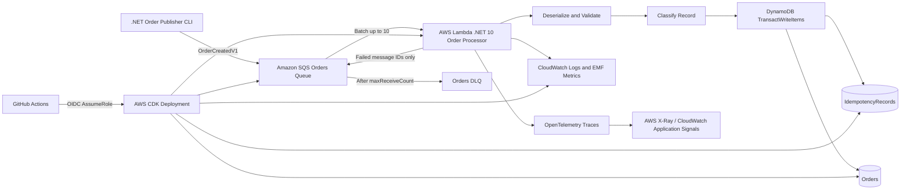

# Reliable Serverless .NET 10 SQS Worker with Transactional Idempotency

> An open-source learning and portfolio project demonstrating reliable event processing with AWS Lambda, Amazon SQS, Amazon DynamoDB, AWS CDK, OpenTelemetry, and GitHub Actions.

**Specification version:** 2.1
**Status:** design complete, backlog created, implementation not started
**Revision log:** see [Appendix A](#appendix-a-revision-log)

---

## 1. Executive Summary

This project implements an event-driven order processor in .NET 10. An Amazon SQS standard queue invokes an AWS Lambda function with batches of order events. The worker validates each event, prevents duplicate business effects, stores the order atomically in DynamoDB, reports per-record failures, and allows repeatedly failing messages to move to a dead-letter queue.

The project deliberately models the delivery contract accurately:

- Amazon SQS and Lambda provide **at-least-once delivery**.
- Duplicate delivery is expected and tested.
- The application provides **idempotent, effectively-once business effects** for DynamoDB order creation.
- It does not claim universal end-to-end exactly-once delivery.

The central correctness mechanism is a DynamoDB transaction that writes the order and its idempotency record as one all-or-nothing operation. This avoids the failure window created by marking a message as processed before the order has actually been saved.

---

## 2. Why This Project Is Valuable

This is a compact project, but it exercises a broad set of commercially useful skills:

### 2.1 AWS skills

- Lambda event source mappings
- SQS batching, visibility timeouts, retries, dead-letter queues, and redrive
- DynamoDB conditional writes, transactions, TTL, on-demand capacity, and point-in-time recovery
- CloudWatch Logs, Embedded Metric Format, dashboards, and alarms
- OpenTelemetry and AWS Distro for OpenTelemetry
- IAM least privilege
- AWS CDK v2 in C#
- Secure GitHub-to-AWS deployments with OpenID Connect
- Cloud-based end-to-end testing

### 2.2 .NET skills

- .NET 10 and modern C#
- Dependency injection and composition roots
- `System.Text.Json` source generation
- Immutable message contracts
- Validation and explicit error classification
- Cancellation and timeout handling
- AWS SDK for .NET v4
- Unit, integration, architecture, and end-to-end testing
- Central package management and reproducible builds
- Structured logging and custom metrics
- Native AOT benchmarking as an optional extension

### 2.3 Distributed systems skills

- At-least-once delivery
- Idempotency and duplicate detection
- Atomicity and failure windows
- Poison-message handling
- Partial batch responses
- Backpressure and concurrency control
- Payload versioning
- Correlation and causation
- Operational observability
- Transactional outbox as a future extension

---

## 3. Project Goals

1. Process order events from an SQS standard queue.
2. Handle duplicate delivery without creating duplicate orders.
3. Atomically persist the order and idempotency record.
4. Return only failed SQS message identifiers in the Lambda batch response.
5. Move repeatedly failing messages to a DLQ.
6. Distinguish successful, duplicate, permanent-failure, and transient-failure outcomes.
7. Define all AWS resources using AWS CDK in C#.
8. Provide secure CI/CD using GitHub Actions and AWS OIDC.
9. Provide structured logs, custom metrics, traces, dashboards, and alarms.
10. Support fast local tests plus authoritative end-to-end tests in a real AWS environment.
11. Be straightforward for another developer to clone, understand, deploy, test, and remove.
12. Demonstrate production engineering decisions without turning a small worker into an unnecessarily complex framework.

---

## 4. Non-Goals

The first production-quality release will not include:

- A complete e-commerce platform
- Payment processing
- Inventory reservation
- A web or mobile user interface
- Multi-Region active-active processing
- Guaranteed ordering between orders
- Multiple inbound event sources
- Long-running workflow orchestration
- External side effects such as email or payment calls
- A generic event-processing framework
- Complex single-table DynamoDB modelling
- A Kubernetes or container-orchestration deployment

Basic contract and business validation are in scope. Complex order-domain validation is not.

---

## 5. Correctness Model

### 5.1 Delivery Semantics

The source queue is an SQS standard queue. Messages can be delivered more than once. Lambda can also retry an individual record after a timeout, service error, throttling event, or partial-batch failure.

The application must therefore treat duplicates as a normal operating condition rather than as an exceptional condition.

Use the following terminology consistently:

- **At-least-once delivery:** the infrastructure may deliver a record more than once.
- **Idempotent processing:** repeating the same operation does not create additional business effects.
- **Effectively-once order creation:** repeated delivery of the same logical order produces one stored order.
- **Exactly-once:** do not use this phrase for the complete SQS-to-Lambda delivery path.

### 5.2 Failure Window in a Mark-Then-Write Design

The following implementation is unsafe:

1. Create the idempotency record.
2. Save the order.
3. Return success.

If the Lambda invocation stops between steps 1 and 2, a retry sees the idempotency record and skips the message even though the order was never saved. This creates data loss.

### 5.3 Transactional Design

The worker uses `TransactWriteItems` to perform both writes atomically:

1. Put the idempotency record only when the event-level idempotency key does not already exist.
2. Put the order only when the order ID does not already exist.

Either both writes succeed or neither write succeeds.

Both `Put` operations must set `ReturnValuesOnConditionCheckFailure = ALL_OLD` so that a cancelled transaction returns the conflicting items directly. See §5.5.

### 5.4 Two Idempotency Scopes Require Two Hashes

The design protects two distinct scopes, and a single hash cannot serve both.

| Scope | Key | Hash | Stored on | Question it answers |
|---|---|---|---|---|
| Event-level | `eventId` | `EnvelopeSha256` | Idempotency record | Have I seen this exact event before? |
| Domain-level | `orderId` | `BusinessSha256` | Order item | Does this order already exist with the same business data? |

**`EnvelopeSha256`** covers the full canonical event: `schemaVersion`, `eventId`, `eventType`, `occurredAtUtc`, `source`, `correlationId`, `causationId`, and the complete `data` object.

**`BusinessSha256`** covers the canonical `data` object only: `orderId`, `customerId`, `currency`, `amountMinor`, `itemDescription`.

The distinction is load-bearing. A legitimate republish of the same logical order carries a **new** `eventId` and a new `occurredAtUtc`, so its `EnvelopeSha256` necessarily differs from the first event's. Classifying on the envelope hash alone would mark every such republish as a conflict and route a valid order to the DLQ with a high-severity alarm. Only `BusinessSha256` can distinguish a benign republish from genuine data divergence on the same order ID.

Specification v1 defined a single `PayloadSha256` stored on both items. That is superseded.

### 5.5 Duplicate and Conflict Classification

Classification is driven entirely by `TransactionCanceledException.CancellationReasons`, which is positionally aligned with the request's `TransactItems`. Index 0 is the idempotency put; index 1 is the order put.

| Reason at index 0 | Reason at index 1 | Comparison | Result |
|---|---|---|---|
| `ConditionalCheckFailed` | any | `EnvelopeSha256` of returned item matches computed | `Duplicate` (success) |
| `ConditionalCheckFailed` | any | `EnvelopeSha256` differs | `Conflict` (permanent) |
| `None` | `ConditionalCheckFailed` | `BusinessSha256` of returned order matches computed | `Duplicate` (success) |
| `None` | `ConditionalCheckFailed` | `BusinessSha256` differs | `Conflict` (permanent) |
| `TransactionConflict`, `ThrottlingError`, or `ProvisionedThroughputExceeded` at either index | — | — | `TransientFailure` |
| `ValidationError` or `ItemCollectionSizeLimitExceeded` at either index | — | — | `PermanentFailure` (implementation defect; alarm) |

Rules:

- The event-level check takes precedence. When both indexes report `ConditionalCheckFailed`, evaluate the envelope hash first — a repeat of the same `eventId` carrying a different envelope is a conflict regardless of what the order item contains.
- A `Conflict` emits a high-severity log and the `IdempotencyConflicts` metric, and is treated as a permanent processing failure.
- **If a reason reports `ConditionalCheckFailed` but `Item` is null**, the conflicting record was removed between the condition evaluation and the response — most plausibly TTL expiry — or the SDK did not surface it. Classify as `TransientFailure` and retry. Never infer `Duplicate` or `Conflict` from an absent item.

This design does not perform a follow-up `GetItem` after cancellation. Specification v1 did, which cost an extra round-trip on the most common retry path and opened a time-of-check/time-of-use window between the cancelled transaction and the read.

### 5.6 Transaction Requests Must Be Deterministic

The transaction sets a deterministic `ClientRequestToken` as an additional short-lived safeguard against an indeterminate client response. This imposes two hard constraints.

**Token value.** `ClientRequestToken` is limited to 36 characters. A bare UUID `eventId` is exactly 36 characters and fits with no headroom. Do not prefix, namespace, or otherwise decorate the token — use the `eventId` verbatim.

**Request body determinism.** DynamoDB raises `IdempotentParameterMismatchException` when the same token is reused within the 10-minute idempotency window with a *different* request body. Therefore every attribute value written by the transaction must be a pure function of the validated event and static configuration. Specifically:

- `ExpirationEpochSeconds` is derived from `occurredAtUtc + IdempotencyRetentionDays`, **not** from wall-clock `now`.
- `CreatedAtUtc` on the order item is `occurredAtUtc`, **not** wall-clock `now`.
- No attribute may carry a generated timestamp, GUID, or attempt counter.

If a wall-clock value leaked into the request body, two attempts at the same event milliseconds apart would produce different bodies and the second would fail with `IdempotentParameterMismatchException` — turning a routine retry of a valid event into an error.

`TimeProvider` is still injected, but is used only for latency metrics and the invocation deadline check (§10.7). It must not influence any persisted attribute.

Because the request body is deterministic, `IdempotentParameterMismatchException` can only mean that the same `eventId` carried different business data inside the token window. Map it to `Conflict` (permanent), not to the default transient bucket.

Durable correctness comes from the conditional writes and persisted records. The token is a 10-minute convenience, not the correctness boundary.

### 5.7 TTL Is Cleanup, Not a Correctness Boundary

DynamoDB TTL removes old idempotency records asynchronously. Code must not assume that an item disappears at the exact expiry timestamp.

The order item remains protected by a conditional `OrderId` write even after the event-level idempotency record has expired. After expiry, a replayed event falls through to the order-level check and is classified on `BusinessSha256` per §5.5 — which is only correct because the order item carries its own business hash.

Recommended initial retention:

- Source queue retention: 4 days
- DLQ retention: 14 days
- Idempotency record retention: 30 days

The idempotency duration must be configurable rather than hard-coded.

### 5.8 External Side Effects

The first release only performs DynamoDB writes that can participate in one transaction.

Do not later add payment, email, webhook, or other external calls directly after claiming an idempotency key and assume the design remains correct. External side effects require a different reliability pattern.

The recommended extension is:

1. Atomically write the order and an outbox item.
2. Publish the outbox item through DynamoDB Streams.
3. Process the downstream side effect idempotently.
4. Record downstream delivery state.

This becomes the advanced transactional-outbox milestone.

---

## 6. Event Contract

Use a versioned envelope so transport and domain metadata do not become mixed together.

```json
{
  "schemaVersion": 1,
  "eventId": "0d76e91c-44e6-4fba-901f-bfdb76645299",
  "eventType": "order.created",
  "occurredAtUtc": "2026-08-01T10:30:00Z",
  "source": "sample.order-publisher",
  "correlationId": "f1e02471-f9da-437f-bc32-e4e65394658a",
  "causationId": null,
  "data": {
    "orderId": "ORD-100001",
    "customerId": "CUS-90001",
    "currency": "GBP",
    "amountMinor": 1299,
    "itemDescription": "Mechanical keyboard"
  }
}
```

### 6.1 Contract Rules

- `schemaVersion` is required and must currently equal `1`.
- `eventId` is required and must be a valid UUID. Its canonical string form is 36 characters — see §5.6.
- `eventType` must equal `order.created`.
- `occurredAtUtc` must be a UTC instant: after deserialization to `DateTimeOffset`, `Offset` must equal `TimeSpan.Zero`. A value with a non-zero offset is rejected rather than normalised, because normalising would change the hash input.
- `occurredAtUtc` must fall within a bounded skew window of processing time — recommended: not more than 24 hours in the future and not more than the source queue retention plus 1 day in the past. Both bounds are configurable. This is a validation rule, not a correctness mechanism, and uses `TimeProvider`.
- `source` is required and length-limited.
- `correlationId` is required.
- `orderId` and `customerId` are required and length-limited.
- `currency` is a three-letter uppercase currency code.
- `amountMinor` is a positive integer in the currency's minor unit.
- `itemDescription` is required and length-limited. Field limits must keep the worst-case DynamoDB item well under the 400 KB item-size ceiling.
- Unknown top-level fields are tolerated for forward compatibility.
- Unknown schema versions must not be silently processed.

Using an integer minor-unit amount avoids floating-point ambiguity.

**Consequence of tolerating unknown fields:** unknown fields are dropped during canonicalisation and therefore do not contribute to either hash. Two events differing only in fields this schema version does not know about hash identically and are classified as duplicates of one another. This is intended — a v1 processor has no basis on which to treat unrecognised data as business-significant — but it is load-bearing and must be stated in `docs/correctness-model.md` and covered by a test.

### 6.2 Idempotency Keys

Two safeguards operate at different scopes, each with its own hash. See §5.4 for the full mapping.

- Event-level key: `eventId`, compared on `EnvelopeSha256`.
- Domain-level key: `orderId`, compared on `BusinessSha256`.

A repeated `eventId` with the same envelope hash is a duplicate.

A new `eventId` attempting to create an existing `orderId` is either:

- a duplicate logical order when `BusinessSha256` matches the stored order; or
- a conflict when it differs.

### 6.3 Canonical Representation and Hashing

Both hashes must be deterministic across machines, processes, and .NET versions.

1. Map the deserialized event into an explicit canonical internal representation. Do not hash the deserialized contract types directly; a canonical type makes the hash input a deliberate, reviewable decision.
2. Serialize with a dedicated source-generated `System.Text.Json` context that fixes property order, uses invariant number and string formatting, writes `occurredAtUtc` in round-trip UTC form (`"O"`), and does not emit indentation.
3. Hash the UTF-8 bytes with SHA-256.
4. Store the lowercase hexadecimal hash.

`EnvelopeSha256` hashes the canonical envelope. `BusinessSha256` hashes the canonical `data` object alone. The `data` canonicalisation used for `BusinessSha256` must be the identical routine nested inside the envelope canonicalisation, so the two can never drift.

Do not hash the raw SQS body — insignificant JSON formatting differences would create different hashes.

---

## 7. High-Level Architecture



---

## 8. Runtime and Technology Decisions

| Area | Decision |
|---|---|
| Runtime | AWS Lambda managed .NET 10 runtime, identifier supplied by configuration (§9.3) |
| Language | C# 14 |
| AWS SDK | AWS SDK for .NET v4 |
| Deployment package | Managed-runtime ZIP package |
| Serialization | `System.Text.Json` with source-generated metadata |
| Queue | Amazon SQS standard queue |
| Persistence | Amazon DynamoDB on-demand tables |
| Atomicity | DynamoDB `TransactWriteItems` |
| IaC | AWS CDK v2 in C# |
| Unit testing | xUnit |
| Test doubles | NSubstitute, Moq, or small hand-written fakes; choose one consistently |
| DynamoDB integration testing | Official `amazon/dynamodb-local` container via Testcontainers |
| SQS integration testing | LocalStack via Testcontainers |
| Authoritative testing | Ephemeral real-AWS end-to-end stack |
| Logging | `Microsoft.Extensions.Logging` or Lambda Powertools structured logging to stdout |
| Metrics | CloudWatch Embedded Metric Format |
| Tracing | OpenTelemetry with the ADOT collector layer and manual instrumentation (§14) |
| CI/CD | GitHub Actions with AWS OIDC |
| Security checks | CodeQL, dependency review, Dependabot, `cdk-nag` |
| Licence | Apache-2.0 or MIT; choose before the first public release |

### 8.1 Runtime Note

This is a managed-runtime Lambda, not a custom-runtime Lambda. Native AOT can be explored as a benchmark after the non-AOT implementation is complete and all selected libraries have been verified for trimming and AOT compatibility.

Confirm that the managed .NET 10 runtime identifier is available in the target Region before the CDK assertions in §18.4 depend on it. The CDK construct reads the runtime from `EnvironmentConfig` (§21) so that falling back to a container image or an earlier managed runtime does not require editing the construct.

---

## 9. AWS Resource Specification

### 9.1 Source Queue

Logical name: `OrdersQueue`

Recommended development defaults:

- Queue type: Standard
- Encryption: SQS-managed server-side encryption
- Message retention: 4 days
- Visibility timeout: 210 seconds — computed, never literal; see below
- Delivery delay: 0 seconds
- Receive message wait time: 20 seconds. This affects only the publisher CLI and any manual `ReceiveMessage` call. The Lambda event source mapping manages its own polling and ignores the queue setting.
- DLQ: `OrdersDeadLetterQueue`
- `maxReceiveCount`: 5
- Resource policy: no public or cross-account send access by default
- Tags:
  - `Project=ReliableOrdersWorker`
  - `Environment=<environment>`
  - `ManagedBy=CDK`

**Visibility timeout formula.** AWS guidance is a visibility timeout of at least six times the function timeout, plus the maximum batching window. This project adds an explicit operational margin so that a future timeout increase does not silently invalidate the queue configuration:

```text
visibilityTimeout = (6 × lambdaTimeoutSeconds) + batchWindowSeconds + safetyMarginSeconds
```

With the development defaults:

```text
(6 × 30) + 1 + 29 = 210 seconds
```

The `MessagingConstruct` must **compute** this value from `EnvironmentConfig` rather than accept it as a parameter. Otherwise the CDK assertion in §18.4 asserts a constant against itself and verifies nothing.

### 9.2 Dead-Letter Queue

Logical name: `OrdersDeadLetterQueue`

- Queue type: Standard
- Encryption: enabled
- Message retention: 14 days
- Redrive allow policy: restrict use to the intended source queue where supported
- CloudWatch alarm: visible message count greater than zero
- Runbook: inspect, diagnose, repair, redrive, and verify
- Do not automatically redrive messages without understanding the failure cause

### 9.3 Lambda Function

Logical name: `OrderProcessorFunction`

Initial configuration:

- Runtime: managed .NET 10, identifier supplied by `EnvironmentConfig`
- Package: ZIP
- Architecture: configurable; benchmark ARM64 and x86_64
- Memory: 512 MB initial value
- Timeout: 30 seconds
- Ephemeral storage: default unless benchmark data justifies more
- Reserved concurrency: configurable, initial development value 10
- Environment:
  - `ORDERS_TABLE_NAME`
  - `IDEMPOTENCY_TABLE_NAME`
  - `IDEMPOTENCY_RETENTION_DAYS`
  - `POWERTOOLS_SERVICE_NAME` or equivalent service name
  - `ENVIRONMENT`
  - `LOG_LEVEL`
  - `MAX_EVENT_SKEW_FUTURE_HOURS`
  - `MAX_EVENT_SKEW_PAST_DAYS`
- Tracing: OpenTelemetry only. X-Ray active tracing must be **disabled** — see §14.
- Log format: JSON
- Log retention: explicitly configured
- No VPC attachment unless a real private-network dependency is introduced
- Least-privilege execution role

### 9.4 Event Source Mapping

- Source: `OrdersQueue`
- Batch size: 10
- Maximum batching window: 1 second
- Enabled: true
- Function response type: `ReportBatchItemFailures`
- Maximum concurrency: configurable, initial value 10
- Event source mapping metrics: enabled where available
- Bisect batch: not applicable to SQS
- Filtering: not required for V1 because the queue carries only `order.created`

Maximum concurrency must be less than or equal to the function's reserved concurrency, so the event source cannot request more concurrent executions than the function is allowed to use. A CDK assertion enforces the relationship.

### 9.5 Orders Table

Logical name: `OrdersTable`

- Partition key: `OrderId` string
- Billing mode: on-demand
- Encryption: enabled
- Point-in-time recovery:
  - enabled in persistent environments
  - configurable in disposable development environments
- Deletion protection:
  - enabled in production-like environments
  - disabled in ephemeral tests
- Removal policy:
  - retain for production
  - destroy for ephemeral test stacks
- No secondary index in V1 because no query access pattern requires one

Attributes:

```text
OrderId              partition key
CustomerId
Currency
AmountMinor
ItemDescription
BusinessSha256       hash of the canonical data object; drives order-level classification
EventId              provenance: the event that created this order
CorrelationId
SchemaVersion
OccurredAtUtc
CreatedAtUtc         equals OccurredAtUtc — see §5.6
```

`BusinessSha256` is not optional or diagnostic. §5.5 reads it out of the condition-check failure to distinguish a benign republish from a genuine conflict.

### 9.6 Idempotency Table

Logical name: `IdempotencyRecordsTable`

- Partition key: `IdempotencyKey` string, whose value is the `eventId` verbatim, with no prefix or namespace (§5.6)
- Billing mode: on-demand
- TTL attribute: `ExpirationEpochSeconds`
- Encryption: enabled
- Point-in-time recovery: configurable
- No secondary index in V1

Attributes:

```text
IdempotencyKey          partition key, equals EventId
OrderId
EnvelopeSha256          hash of the canonical envelope; drives event-level classification
Status
OccurredAtUtc
CompletedAtUtc          equals OccurredAtUtc — see §5.6
ExpirationEpochSeconds  derived from OccurredAtUtc + retention — see §5.6
```

The `EntityType` and `EntityId` attributes from specification v1 are removed. They implied a multi-entity keyspace in this table, but the transaction writes exactly one idempotency row per event and order-level protection comes from the Orders table's own conditional put. Carrying them would suggest a second row that is never written.

For the transactional V1 design, the stored status is normally `COMPLETED` because the idempotency item and order are committed together.

---

## 10. Application Components

### 10.1 Transport-Neutral Message Input

The core project must not reference AWS types. `ReliableOrders.Core` therefore defines its own inbound message shape, and the Lambda project maps `SQSEvent.SQSMessage` onto it.

```csharp
public sealed record IncomingMessage(
    string MessageId,
    string Body,
    int ApproximateReceiveCount,
    IReadOnlyDictionary<string, string> Attributes);
```

Specification v1 placed `SQSEvent.SQSMessage` on `IOrderMessageProcessor`, which contradicted both the layering rule in §19 and the architecture test in §18.6.

### 10.2 `OrderEventParser`

Responsibilities:

- Reject null or blank message bodies.
- Deserialize with source-generated `System.Text.Json`.
- Reject malformed JSON.
- Reject unsupported schema versions.
- Return a typed `OrderCreatedV1` envelope.
- Never log the complete raw message body.

```csharp
public interface IOrderEventParser
{
    ParseResult Parse(string messageBody);
}

public abstract record ParseResult
{
    private protected ParseResult() { }

    public sealed record Parsed(OrderCreatedV1 Event) : ParseResult;
    public sealed record Malformed(string Reason) : ParseResult;
    public sealed record UnsupportedSchemaVersion(int SchemaVersion) : ParseResult;
}
```

`Reason` must be a stable, body-free description suitable for logging.

### 10.3 `OrderEventValidator`

Responsibilities:

- Validate envelope metadata.
- Validate order identifiers and length limits.
- Validate currency format.
- Validate positive minor-unit amount.
- Validate item description.
- Validate UTC offset and the skew window (§6.1).
- Return structured validation failures.

```csharp
public sealed record ValidationFailure(string Field, string Rule);

public sealed record ValidationResult(IReadOnlyList<ValidationFailure> Failures)
{
    public bool IsValid => Failures.Count == 0;
}
```

Keep transport parsing and domain validation separate.

### 10.4 `CanonicalPayloadHasher`

Responsibilities:

- Map an event into a canonical representation.
- Serialize deterministically.
- Produce both SHA-256 hashes from one traversal, so envelope and business canonicalisation cannot drift.
- Be deterministic across machines and repeated executions.

```csharp
public sealed record PayloadHashes(string EnvelopeSha256, string BusinessSha256);

public interface IPayloadHasher
{
    PayloadHashes ComputeHashes(OrderCreatedV1 message);
}
```

### 10.5 `IOrderCommandStore`

This interface owns the atomic persistence operation.

```csharp
public interface IOrderCommandStore
{
    Task<OrderWriteResult> TryCreateAsync(
        OrderCreatedV1 message,
        PayloadHashes hashes,
        CancellationToken cancellationToken);
}
```

Possible results:

```csharp
public abstract record OrderWriteResult
{
    private protected OrderWriteResult() { }

    public sealed record Created : OrderWriteResult;
    public sealed record Duplicate(DuplicateScope Scope) : OrderWriteResult;
    public sealed record Conflict(ConflictScope Scope, string Reason) : OrderWriteResult;
    public sealed record TransientFault(string Reason) : OrderWriteResult;
}

public enum DuplicateScope { Event, Order }
public enum ConflictScope { Event, Order, TokenMismatch }
```

The `private protected` constructor closes the hierarchy so consumers can switch exhaustively without a defensive default arm.

Note the absence of a `now` parameter. Specification v1 passed `DateTimeOffset now` into this method; §5.6 requires every persisted value to derive from the event, so accepting a clock here would invite the determinism bug back in.

The interface must not expose separate `TryMarkAsync` and `SaveAsync` calls, because doing so makes it easy to reintroduce the unsafe two-write sequence.

### 10.6 `DynamoDbOrderCommandStore`

Responsibilities:

- Build a two-item `TransactWriteItems` request: index 0 idempotency put, index 1 order put.
- Use conditional puts (`attribute_not_exists`) on both items.
- Set `ReturnValuesOnConditionCheckFailure = ALL_OLD` on both puts.
- Set `ClientRequestToken` to the `eventId` verbatim.
- Guarantee request-body determinism per §5.6 — no wall-clock values.
- Classify `TransactionCanceledException` from `CancellationReasons` per the §5.5 table, without a follow-up read.
- Map `IdempotentParameterMismatchException` to `Conflict(ConflictScope.TokenMismatch, …)`.
- Treat `ConditionalCheckFailed` with a null `Item` as `TransientFault`.
- Preserve cancellation — never convert `OperationCanceledException` into a transient fault.
- Avoid logging entire DynamoDB items.

### 10.7 `OrderMessageProcessor`

Processes one message.

```csharp
public interface IOrderMessageProcessor
{
    Task<MessageProcessingResult> ProcessAsync(
        IncomingMessage message,
        ProcessingContext context,
        CancellationToken cancellationToken);
}

public sealed record ProcessingContext(
    string LambdaRequestId,
    string Service,
    string Environment);

public sealed record MessageProcessingResult(
    string MessageId,
    MessageProcessingOutcome Outcome,
    string? Reason,
    TimeSpan Duration)
{
    public bool ShouldReportAsFailure =>
        Outcome is not (MessageProcessingOutcome.Processed or MessageProcessingOutcome.Duplicate);
}

public enum MessageProcessingOutcome
{
    Processed,
    Duplicate,
    PermanentFailure,
    TransientFailure,
    DeadlineDeferred
}
```

`DeadlineDeferred` is distinct from `TransientFailure` because §13 counts them separately and their operational meanings differ: one is a downstream fault, the other is self-inflicted back-pressure.

Responsibilities:

1. Create a logging scope.
2. Parse.
3. Validate.
4. Hash.
5. Persist transactionally.
6. Classify the result.
7. Emit metrics and structured logs.
8. Return a typed result to the batch handler.

### 10.8 `SqsBatchHandler`

Responsibilities:

- Map each `SQSEvent.SQSMessage` to `IncomingMessage`.
- Process each record independently.
- Add only retryable or intentionally failed records to `BatchItemFailures`.
- Return the SQS `messageId`, never the domain event ID.
- Never emit a null, empty, whitespace, or duplicate `itemIdentifier`. Lambda reprocesses the **entire batch** when the failure list contains an identifier it does not recognise, which silently converts a one-record failure into a ten-record replay. Assert non-empty and distinct before returning.
- Respect a safety deadline derived from `ILambdaContext.RemainingTime`.
- Avoid allowing one unhandled record exception to prevent reporting the state of other records.

**Deadline margin.** Records deferred at the deadline are returned as failures, so their `ApproximateReceiveCount` increments on redelivery. Sustained deadline pressure can therefore drive valid, never-attempted messages to the DLQ. Size the margin against observed p99 per-record latency rather than a constant, alarm on `DeadlineDeferrals`, and prefer reducing batch size over shrinking the margin.

Initial implementation should process records sequentially. Bounded parallelism can be added only after correctness tests and metrics exist.

### 10.9 Composition Root

The Lambda function constructor or executable startup code should:

- Build the service collection once per execution environment.
- Register AWS SDK clients once.
- Register application services.
- Configure JSON source generation.
- Configure logging, metrics, and tracing.
- Validate configuration during cold start and fail fast with a named-variable message.
- Avoid creating service clients inside each record-processing call.

**`SQSBatchResponse` must be registered in the serializer context.** With source-generated `System.Text.Json` and no reflection fallback, an unregistered response type serialises to `{}`. Lambda reads that as an empty `batchItemFailures` array and marks the **entire batch successful** — every failed record is deleted from the queue and lost, with no error anywhere in the logs. Unit tests that assert on the returned object rather than on serialised bytes will not catch this. Register `SQSBatchResponse` and `SQSBatchResponse.BatchItemFailure` explicitly, and add the round-trip test in §18.1.

---

## 11. Error Classification

| Failure | Classification | Batch result | Expected final destination |
|---|---|---|---|
| Valid new event | Success | Do not return ID | Orders table |
| Duplicate event ID, matching envelope hash | Success | Do not return ID | Existing order remains |
| Duplicate order ID, matching business hash | Success | Do not return ID | Existing order remains |
| Malformed JSON | Permanent | Return ID in V1 | DLQ after retry policy |
| Unsupported schema version | Permanent | Return ID in V1 | DLQ after retry policy |
| Validation failure | Permanent | Return ID in V1 | DLQ after retry policy |
| Same event ID, different envelope hash | Permanent conflict | Return ID | DLQ and alarm |
| Same order ID, different business hash | Permanent conflict | Return ID | DLQ and alarm |
| `IdempotentParameterMismatchException` | Permanent conflict | Return ID | DLQ and alarm |
| `ConditionalCheckFailed` with null returned item | Transient | Return ID | Retry |
| DynamoDB throttling, `TransactionConflict`, or transient service fault | Transient | Return ID | Retry, then DLQ if unresolved |
| DynamoDB `ValidationError` in a cancellation reason | Permanent | Return ID | DLQ and alarm — indicates a code defect |
| Lambda nearing timeout | Deadline deferred | Return unprocessed ID | Retry |
| Unexpected exception | Transient by default | Return ID | Retry, then DLQ |

### 11.1 Retry Amplification of Permanent Failures

Every permanent failure is returned in `BatchItemFailures` and redelivered until `maxReceiveCount` is exhausted. With `maxReceiveCount = 5`, a single poison message produces **five** `ValidationFailures` data points, and a single genuine conflict produces **five** `IdempotencyConflicts` data points — against alarm thresholds of "greater than zero".

Mitigation for V1: emit permanent-failure metrics only when `ApproximateReceiveCount == 1`, so each distinct bad message contributes exactly one data point. Logs are still emitted on every attempt, with `ApproximateReceiveCount` in the scope, so the retry history remains visible without distorting the metric.

A later version can add an `OrdersQuarantineQueue` for permanent validation failures so invalid events do not consume all retry attempts. If quarantine publishing fails, the source record must still be returned as failed.

---

## 12. Logging Specification

Use JSON structured logging to standard output. Lambda delivers the output to CloudWatch Logs.

Do not make synchronous CloudWatch logging API calls from the handler.

Every record-processing scope should include:

- `Service`
- `Environment`
- `LambdaRequestId`
- `SqsMessageId`
- `EventId`, when parsed
- `OrderId`, when parsed
- `CorrelationId`, when parsed
- `ApproximateReceiveCount`
- `Outcome`
- `DurationMs`

Recommended events:

- `BatchStarted`
- `MessageParsingFailed`
- `MessageValidationFailed`
- `OrderCreated`
- `DuplicateIgnored`
- `IdempotencyConflict`
- `TransientProcessingFailure`
- `BatchCompleted`
- `ProcessingDeadlineReached`

Do not log:

- Full SQS bodies
- Customer personal data
- AWS credentials
- Security tokens
- Full exception payloads containing message bodies
- Complete DynamoDB items returned by a condition-check failure — log the compared hashes only

---

## 13. Metrics Specification

Emit custom metrics asynchronously through CloudWatch Embedded Metric Format.

| Metric | Unit | Meaning |
|---|---|---|
| `OrdersProcessed` | Count | New orders committed |
| `DuplicateEvents` | Count | Duplicate events safely ignored |
| `ValidationFailures` | Count | Permanently invalid events |
| `IdempotencyConflicts` | Count | Key or order ID reused with different data |
| `TransientFailures` | Count | Retryable record failures |
| `RecordProcessingLatency` | Milliseconds | End-to-end per-record processing duration |
| `BatchSize` | Count | Number of records received |
| `BatchFailures` | Count | Failed records returned in the batch response |
| `DeadlineDeferrals` | Count | Records deferred because invocation time was low |

Dimensions — use only:

- `Service`
- `Environment`

`Outcome` is **not** a dimension. Specification v1 listed it alongside per-outcome metric names, which counted every record twice under two incompatible query shapes. The discrete metric names are retained because the §15 alarms are per-outcome; the dimension is dropped.

Never use `OrderId`, `EventId`, `CustomerId`, or `SqsMessageId` as metric dimensions.

Permanent-failure metrics are gated on `ApproximateReceiveCount == 1` per §11.1.

**Cost note.** Per-record EMF to stdout makes CloudWatch Logs ingestion the dominant cost of this project at any meaningful volume. Record this in `docs/cost-model.md` alongside the fact that DynamoDB transactional writes consume twice the write capacity of an equivalent unconditional `PutItem`.

---

## 14. Tracing Specification

Use OpenTelemetry rather than adding new direct dependencies on the legacy X-Ray SDK.

**Choose one tracing pipeline, not both.** Enabling Lambda X-Ray active tracing alongside an OTel exporter produces two disconnected trace trees for the same invocation. This project selects OTel; §9.3 therefore requires active tracing to be disabled, and a CDK assertion enforces it.

**Realistic scope for .NET.** OTel auto-instrumentation on Lambda is substantially weaker for .NET than for Node.js, Python, or Java. Plan for the ADOT collector layer plus **manual** OTel SDK wiring in the composition root. Do not budget this story on the assumption that a layer alone yields useful spans.

Approach:

- Add the ADOT collector layer and configure the OTLP exporter.
- Use one application-wide `ActivitySource`.
- Instrument DynamoDB AWS SDK calls via the AWS SDK instrumentation package.
- Add spans for parsing, validation, canonical hashing, transactional persistence, and duplicate classification.
- Propagate W3C trace context through SQS message attributes where the publisher supports it. The event source mapping does not link producer and consumer traces automatically; the link exists only because the publisher wrote the context and the handler read it.
- Export to AWS X-Ray and/or CloudWatch Application Signals.
- Keep trace attributes free of sensitive data — no raw bodies, no customer identifiers.

Treat tracing as diagnostic telemetry, not as a source of business correctness.

---

## 15. CloudWatch Dashboard and Alarms

Create a dashboard in CDK containing:

- SQS visible messages
- SQS messages in flight
- Age of oldest source-queue message
- DLQ visible messages
- Lambda invocations
- Lambda errors
- Lambda throttles
- Lambda duration
- Lambda concurrent executions
- DynamoDB consumed capacity
- DynamoDB throttled requests
- Custom processed, duplicate, conflict, and failure metrics
- Per-record latency
- Deadline deferrals

Required alarms:

1. DLQ visible messages greater than zero.
2. Idempotency conflicts greater than zero.
3. Age of oldest source message above an agreed threshold.
4. Lambda throttles above zero for a sustained period.
5. Transient record failures above a threshold.
6. DynamoDB throttling or system errors.
7. No successful processing while messages remain available — a composite alarm over `OrdersProcessed` and `ApproximateNumberOfMessagesVisible`.
8. Deadline deferrals above a threshold, indicating the batch size or deadline margin needs adjustment.

Thresholds assume the §11.1 gating. If permanent-failure metrics were ever emitted on every attempt, thresholds 2 and 5 would need to absorb a factor of `maxReceiveCount`.

Partial batch processing can produce successful Lambda invocations that still contain failed records, so custom record-level failure metrics are mandatory.

---

## 16. Security Requirements

- Use GitHub OIDC; do not store long-lived AWS access keys in GitHub.
- Restrict the OIDC role trust policy to the repository, branch or tag, and GitHub environment.
- Separate CI permissions from deployment permissions.
- Set `contents: read` by default in GitHub Actions.
- Grant `id-token: write` only to deployment jobs that need it.
- Pin third-party GitHub Actions to immutable commit SHAs.
- Apply least-privilege IAM to:
  - SQS receive/delete/change-visibility operations
  - DynamoDB item and transaction operations on the two tables
  - CloudWatch logging
  - tracing and telemetry where needed
- Avoid wildcard resource permissions where service APIs support resource scoping.
- Configure a CDK bootstrap permissions boundary for a hardened deployment environment.
- Add `cdk-nag` checks and explicitly document any suppressed finding.
- Enable Dependabot, CodeQL, secret scanning, and dependency review.
- Validate message sizes and field lengths. SQS caps a message at 256 KB; field limits must additionally keep the derived DynamoDB item well under 400 KB.
- Do not place the Lambda in a VPC unless required.
- Do not expose the queue publicly.
- Use encryption at rest for queues, tables, and logs where appropriate.
- Keep production data when a stack is deleted; only ephemeral stacks may destroy data.
- Add a threat model covering malformed events, replay, key reuse, resource exhaustion, logging leakage, and compromised CI.

---

## 17. CI/CD Design

Use separate workflows.

### 17.1 Pull Request CI

File: `.github/workflows/ci.yml`

Steps:

1. Checkout.
2. Install the pinned .NET SDK from `global.json`.
3. Restore using locked dependencies.
4. Verify formatting.
5. Build in Release mode.
6. Run unit tests.
7. Run integration tests.
8. Collect test results and coverage.
9. Run architecture tests.
10. Run `cdk synth`.
11. Run CDK assertion tests.
12. Run security and dependency checks.
13. Upload test and coverage artifacts.
14. Never assume a privileged AWS deployment role from an untrusted fork.

### 17.2 Development Deployment

File: `.github/workflows/deploy-dev.yml`

Trigger options:

- push to `main` after CI succeeds; or
- manual workflow dispatch.

Steps:

1. Obtain short-lived AWS credentials through OIDC.
2. Run `cdk synth`.
3. Run `cdk diff`.
4. Deploy the development stack.
5. Execute smoke tests.
6. Publish the stack outputs and test summary.

### 17.3 Release Deployment

File: `.github/workflows/release.yml`

Trigger:

- signed version tag or manual dispatch.

Requirements:

- GitHub protected environment
- optional reviewer approval
- restricted OIDC role
- immutable action SHAs
- deployment concurrency group
- generated release notes
- provenance or artifact attestation where useful

### 17.4 Ephemeral AWS End-to-End Test

File: `.github/workflows/e2e.yml`

Steps:

1. Generate a unique stack name.
2. Deploy an ephemeral AWS stack.
3. Send valid, duplicate, republished, conflicting, and malformed messages.
4. Assert DynamoDB and queue outcomes.
5. Capture logs and metrics on failure.
6. Destroy the stack in an `always()` cleanup step.
7. Use resource tags and a cleanup script to remove orphaned test stacks.

---

## 18. Testing Strategy

### 18.1 Unit Tests

Required cases:

1. Valid event is parsed.
2. Malformed JSON is rejected.
3. Unsupported schema version is rejected.
4. Validation failures are structured.
5. Non-UTC `occurredAtUtc` is rejected rather than normalised.
6. `occurredAtUtc` outside the skew window is rejected.
7. Canonical hashes are deterministic across processes.
8. Events differing only in unknown top-level fields produce identical hashes (§6.1).
9. Two events with different `eventId` but identical `data` produce different `EnvelopeSha256` and identical `BusinessSha256`.
10. The transaction request body is byte-identical across two attempts at the same event, with `TimeProvider` advanced between them (§5.6).
11. Valid new order returns `Processed`.
12. Repeated event ID with matching envelope hash returns `Duplicate(Event)`.
13. New event ID, existing order ID, matching business hash returns `Duplicate(Order)`.
14. Reused event ID with a differing envelope hash returns `Conflict(Event)`.
15. New event ID, existing order ID, differing business hash returns `Conflict(Order)`.
16. `IdempotentParameterMismatchException` returns `Conflict(TokenMismatch)` and is not retried.
17. `ConditionalCheckFailed` with a null returned item returns `TransientFailure`.
18. Transient DynamoDB exception returns `TransientFailure`.
19. One failed record produces exactly one batch item failure.
20. Successful records are not included in `BatchItemFailures`.
21. Batch handler returns SQS message IDs rather than event IDs.
22. The failure list never contains null, empty, whitespace, or duplicate identifiers (§10.8).
23. `SQSBatchResponse` round-trips through the configured `ILambdaSerializer` and the serialised bytes contain the expected `batchItemFailures` entries (§10.9).
24. Processing stops safely when the invocation deadline is near and returns `DeadlineDeferred`.
25. Logs do not contain the raw message body.
26. Logs do not contain complete DynamoDB items.
27. Metric dimensions do not contain high-cardinality identifiers.
28. Permanent-failure metrics are suppressed when `ApproximateReceiveCount > 1` (§11.1).
29. Cancellation tokens are forwarded, and `OperationCanceledException` is not reclassified as transient.
30. Persisted timestamps derive from `occurredAtUtc`, not from `TimeProvider`.

### 18.2 Concurrency Tests

Required cases:

1. Two concurrent calls for the same event produce one creation and one duplicate.
2. Two event IDs for the same order and same business data produce one order and a `Duplicate(Order)`.
3. Two event IDs for the same order and different business data produce a `Conflict(Order)`.
4. Transaction cancellation is classified correctly from `CancellationReasons` alone, with no follow-up read.
5. A retry after an indeterminate client response remains safe within the `ClientRequestToken` window.
6. A retry after the `ClientRequestToken` window has elapsed is still classified as `Duplicate` by the conditional writes.

### 18.3 Integration Tests

Run against containers via Testcontainers.

**Use the official `amazon/dynamodb-local` image for all transaction tests.** The entire classification path in §10.6 depends on `CancellationReasons[i].Code` being accurate and on `CancellationReasons[i].Item` being populated when `ReturnValuesOnConditionCheckFailure` is set. LocalStack's DynamoDB implementation is not dependable on either point, and a false green here would hide the project's core correctness mechanism. Keep LocalStack for SQS only.

Verify:

- DynamoDB transaction succeeds for a new order.
- Conditional transaction prevents duplicates.
- `CancellationReasons` carries the conflicting items when the condition fails.
- Both hashes are stored on the correct items.
- TTL attributes are written correctly and derive from `occurredAtUtc`.
- SQS messages can be produced and consumed.
- Batch response mapping is correct.
- Environment configuration is wired correctly.

Local emulation is not the final authority for IAM, Lambda polling, CloudWatch, DLQ movement, transaction cancellation semantics, or service-specific edge cases.

### 18.4 CDK Tests

Use CDK assertions rather than relying only on a full-template snapshot.

Verify:

- Lambda uses the configured .NET 10 managed runtime.
- Event source mapping enables `ReportBatchItemFailures`.
- Queue visibility timeout equals `(6 × lambdaTimeout) + batchWindow + safetyMargin` computed from the same `EnvironmentConfig` the construct consumed.
- Event source mapping maximum concurrency is less than or equal to the function's reserved concurrency.
- DLQ retention exceeds source retention.
- `maxReceiveCount` is at least 5.
- Queue and table encryption are enabled.
- Lambda timeout, memory, and concurrency are configured.
- X-Ray active tracing is disabled (§14).
- IAM permissions are resource-scoped.
- Log retention is explicit.
- DynamoDB TTL is enabled on `ExpirationEpochSeconds`.
- Point-in-time recovery and removal policy vary correctly by environment.
- Required dashboard widgets and alarms exist.
- Resource tags exist.

### 18.5 Real AWS End-to-End Tests

Required scenarios:

1. Send one valid event and verify one order.
2. Send the same event repeatedly and verify one order.
3. Republish the same order under a new event ID and verify one order and no conflict alarm.
4. Send multiple records where only one is invalid and verify successful records are not retried.
5. Send a poison message and verify it reaches the DLQ after the configured receive count.
6. Send an idempotency conflict and verify the metric and alarm path, and that the metric fires once rather than once per retry.
7. Verify CloudWatch structured log fields.
8. Verify custom metrics appear.
9. Verify the stack can be destroyed cleanly in an ephemeral environment.

### 18.6 Optional Quality Tests

- Mutation testing for core domain and classification logic
- Architecture tests asserting that `ReliableOrders.Core` references neither `AWSSDK.*` nor `Amazon.Lambda.*`
- Load testing with NBomber or k6
- Lambda memory and architecture benchmarks
- Native AOT versus non-AOT cold-start comparison
- Resilience experiments that inject throttling and timeouts

---

## 19. Repository Structure

```text
aws-dotnet-lambda-sqs-idempotency/
├── src/
│   ├── ReliableOrders.Core/
│   │   ├── Contracts/
│   │   ├── Validation/
│   │   ├── Processing/
│   │   ├── Idempotency/
│   │   └── Observability/
│   ├── ReliableOrders.Aws/
│   │   ├── DynamoDb/
│   │   ├── Sqs/
│   │   └── Telemetry/
│   ├── ReliableOrders.Function/
│   │   ├── Function.cs
│   │   ├── DependencyInjection.cs
│   │   └── Serialization/
│   └── ReliableOrders.Publisher/
│       └── Program.cs
├── infra/
│   └── ReliableOrders.Cdk/
│       ├── Program.cs
│       ├── Configuration/
│       ├── Constructs/
│       └── Stacks/
├── tests/
│   ├── ReliableOrders.UnitTests/
│   ├── ReliableOrders.IntegrationTests/
│   ├── ReliableOrders.ArchitectureTests/
│   ├── ReliableOrders.CdkTests/
│   └── ReliableOrders.EndToEndTests/
├── docs/
│   ├── spec.md
│   ├── architecture.md
│   ├── correctness-model.md
│   ├── threat-model.md
│   ├── cost-model.md
│   ├── testing-strategy.md
│   ├── adr/
│   │   ├── 0001-use-sqs-standard-queue.md
│   │   ├── 0002-use-dynamodb-transactions.md
│   │   ├── 0003-use-dotnet-10-managed-runtime.md
│   │   ├── 0004-use-opentelemetry.md
│   │   └── 0005-separate-envelope-and-business-hashes.md
│   └── runbooks/
│       ├── dlq-investigation-and-redrive.md
│       ├── idempotency-conflict.md
│       └── processing-backlog.md
├── samples/
│   ├── valid-order-created-v1.json
│   ├── duplicate-order-created-v1.json
│   ├── republished-order-created-v1.json
│   ├── conflicting-order-created-v1.json
│   └── invalid-order-created-v1.json
├── scripts/
│   ├── deploy-local.sh
│   ├── send-sample-events.sh
│   ├── run-e2e.sh
│   └── cleanup-ephemeral-stacks.sh
├── .github/
│   ├── ISSUE_TEMPLATE/
│   ├── PULL_REQUEST_TEMPLATE.md
│   ├── dependabot.yml
│   └── workflows/
│       ├── ci.yml
│       ├── deploy-dev.yml
│       ├── e2e.yml
│       ├── codeql.yml
│       └── release.yml
├── .editorconfig
├── Directory.Build.props
├── Directory.Packages.props
├── global.json
├── CONTRIBUTING.md
├── SECURITY.md
├── SUPPORT.md
├── CODE_OF_CONDUCT.md
├── CHANGELOG.md
├── LICENSE
└── README.md
```

The root directory name matches the existing repository, `aws-dotnet-lambda-sqs-idempotency`. See §22.1 on public naming.

Keep the core project free of AWS dependencies — both `AWSSDK.*` and `Amazon.Lambda.*`. AWS-specific adapters belong in `ReliableOrders.Aws`, and the Lambda project acts as the composition root and owns the mapping from `SQSEvent.SQSMessage` to `IncomingMessage`.

---

## 20. .NET Engineering Standards

Recommended repository-wide settings:

```xml
<PropertyGroup>
  <TargetFramework>net10.0</TargetFramework>
  <Nullable>enable</Nullable>
  <ImplicitUsings>enable</ImplicitUsings>
  <TreatWarningsAsErrors>true</TreatWarningsAsErrors>
  <AnalysisLevel>latest-recommended</AnalysisLevel>
  <Deterministic>true</Deterministic>
  <ContinuousIntegrationBuild Condition="'$(CI)' == 'true'">true</ContinuousIntegrationBuild>
</PropertyGroup>
```

Additional standards:

- Pin the SDK with `global.json`.
- Use central package management.
- Commit dependency lock files where appropriate.
- Use `DateTimeOffset` for persisted timestamps.
- Inject `TimeProvider` — for latency, deadlines, and skew validation only. Never for values written inside the transaction (§5.6).
- Forward cancellation tokens.
- Model outcomes as closed record hierarchies with `private protected` constructors; use enums only for flat, dimensionless labels.
- Prefer immutable records for contracts and results.
- Use source-generated JSON serialization, and register every type that crosses the Lambda serializer boundary — request *and* response (§10.9).
- Avoid static mutable state.
- Reuse AWS service clients across invocations.
- Avoid `async void`.
- Avoid sync-over-async.
- Avoid retrying validation and conditional-conflict failures.
- Do not wrap every AWS SDK call in a second generic retry policy.
- Keep exception handling close to the point where a failure can be classified.
- Make logs and metrics part of acceptance criteria, not an afterthought.

---

## 21. AWS CDK Design

Use one application stack for the first release, divided into focused constructs:

- `MessagingConstruct`
- `PersistenceConstruct`
- `OrderProcessorConstruct`
- `ObservabilityConstruct`
- `DeploymentIdentityConstruct` only if deployment identity is managed in the same repository

Configuration should be environment-based and typed:

```csharp
public sealed record EnvironmentConfig(
    string EnvironmentName,
    string LambdaRuntimeIdentifier,
    int LambdaMemoryMb,
    int LambdaTimeoutSeconds,
    int ReservedConcurrency,
    int BatchSize,
    int BatchWindowSeconds,
    int MaxConcurrency,
    int VisibilityMarginSeconds,
    int MaxReceiveCount,
    int SourceRetentionDays,
    int DlqRetentionDays,
    int IdempotencyRetentionDays,
    bool RetainData,
    bool EnablePointInTimeRecovery);
```

Derived values — never parameters:

```csharp
public int VisibilityTimeoutSeconds =>
    (6 * LambdaTimeoutSeconds) + BatchWindowSeconds + VisibilityMarginSeconds;
```

The record validates its own invariants on construction: `MaxConcurrency <= ReservedConcurrency`, `DlqRetentionDays > SourceRetentionDays`, and `MaxReceiveCount >= 5`.

CDK outputs:

- Source queue URL
- DLQ URL
- Lambda function name
- Orders table name
- Idempotency table name
- Dashboard name

Avoid hard-coded account IDs, Regions, queue URLs, and table names in source code.

---

## 22. Open-Source Project Requirements

Before the first public release, add:

- Clear project purpose in the first paragraph of the README
- Architecture diagram
- Correctness model explaining at-least-once, idempotency, and the two hash scopes
- Prerequisites
- Local test instructions
- AWS bootstrap instructions
- Deployment instructions
- Sample event commands
- Duplicate demonstration
- Republish demonstration
- DLQ demonstration
- Teardown instructions
- Estimated cost categories and cleanup warnings
- Security model
- Limitations
- Roadmap
- Contribution guide
- Code of conduct
- Security reporting policy
- Support policy
- Licence
- Issue templates
- Pull request template
- Good-first-issue labels
- Architecture decision records
- Demo recording or animated terminal capture

### 22.1 Repository Naming

The repository already exists as `aws-dotnet-lambda-sqs-idempotency`, and §19 reflects that. It is descriptive and discoverable, leading with the platform and naming the pattern. Renaming carries a cost — broken links, stale clones, lost stars — that a marginal SEO gain does not justify.

Keep the current name. Specification v1's suggestions (`dotnet-sqs-idempotent-worker`, `serverless-dotnet-reliability-lab`) are recorded here only so the decision is visible; if the repository later hosts several reliability patterns, revisit under an ADR.

---

## 23. Delivery

The backlog is maintained as GitHub issues, not in this document. A specification
and a plan have different lifecycles: the design here is stable and reviewed
through pull requests, while the work carries state, ownership, and ordering that
markdown cannot represent. Holding both means one of them is always stale.

Structure:

- Epics are issues labelled `epic`, each also carrying `epic-0` through `epic-9`.
- Stories are issues labelled `story`, attached to their epic as a sub-issue and
  carrying the same `epic-N` label plus an area label.
- Milestones M1 through M6 carry the delivery sequence, in the order given by
  their descriptions.
- Epics are deliberately left off milestones. Two of them span several
  milestones, and an epic closes only after its stories do, so assigning them
  would understate milestone progress throughout.
- Ordering constraints are recorded as issue dependencies rather than prose.

To read the backlog:

```bash
gh issue list --label epic
gh issue list --label story --milestone "M1: Correctness First"
gh issue view <n>
```

Two ordering constraints are load-bearing, and both are argued where the design
lives rather than restated here:

- The key and hash decisions in §5.4 must be settled before any table schema is
  written, because §9.5 and §9.6 persist their outcome.
- Transaction classification cannot be verified against an emulator that does not
  report cancellation reasons faithfully (§18.3).

---


## 24. Definition of Done

A release is complete when:

- The delivery semantics are described accurately.
- No mark-before-save failure window exists.
- Event-level and order-level idempotency are separately hashed, stored, and tested.
- A republished order under a new event ID is a duplicate, not a conflict.
- Transaction request bodies are deterministic and contain no wall-clock values.
- Classification uses `CancellationReasons` with no follow-up read, and an absent returned item is transient.
- New, duplicate, republish, conflict, invalid, and transient scenarios are tested.
- Partial batch response is enabled in both code and infrastructure, and the response survives serialization.
- The failure list can never contain a malformed identifier.
- Queue visibility timeout is computed from a documented formula and asserted in CDK tests.
- Permanent-failure metrics are not amplified by retries.
- Local integration tests pass, with transaction tests on `dynamodb-local`.
- Real AWS end-to-end tests pass.
- IAM is least privilege.
- GitHub deployment uses OIDC.
- Logs are structured and free of raw payload and full-item leakage.
- Record-level metrics, dashboard, and alarms exist.
- Exactly one tracing pipeline is active and OpenTelemetry traces are visible.
- The DLQ runbook has been exercised.
- The stack can be deployed and removed from documented commands.
- The README demonstrates valid, duplicate, republish, mixed-batch, and poison-message flows.
- Security and dependency scans contain no unresolved critical findings.
- The repository contains its licence and contribution policies.
- A tagged release is reproducible from the source commit.

---

## 25. Final Positioning

This project should be presented as:

> A production-minded reference implementation for idempotent SQS batch processing in .NET on AWS, with transactional DynamoDB persistence, partial failure handling, secure infrastructure automation, and full operational telemetry.

That positioning is technically accurate, commercially relevant, and stronger than claiming generic exactly-once processing.

---

## Appendix A: Revision Log

Changes from specification v1. Each entry states what changed and why.

### A.1 Blocking corrections

| # | Change | Sections | Rationale |
|---|---|---|---|
| 1 | Split the single `PayloadSha256` into `EnvelopeSha256` and `BusinessSha256` | 5.4, 5.5, 6.2, 6.3, 9.5, 9.6, 10.4 | v1 hashed "the event" but required a republished order under a new `eventId` to classify as a duplicate. One hash cannot do both: with envelope fields in scope, every legitimate republish became a conflict routed to the DLQ with a high-severity alarm. |
| 2 | Fixed `IdempotencyKey` as the verbatim `eventId`; removed `EntityType` and `EntityId` | 5.6, 9.6 | v1 never specified the key's value, and the two extra attributes implied a second idempotency row that the two-item transaction never writes. |
| 3 | Replaced the visibility-timeout worked example with an explicit formula computed in CDK | 9.1, 18.4, 21 | v1's table summed to 181 or 211, never the stated 210, and §18.4 required a test against a formula that was never written down. |
| 4 | Documented the 36-character `ClientRequestToken` limit and mapped `IdempotentParameterMismatchException` | 5.6, 10.6, 11 | A bare UUID fits exactly; any prefix overflows. The exception was unmapped in v1 and fell through to "transient by default", burning all five retries on a permanent condition. |
| 5 | Introduced `IncomingMessage` and removed `SQSEvent.SQSMessage` from core interfaces | 10.1, 10.7, 19, 18.6 | v1's `IOrderMessageProcessor` contradicted its own layering rule and would have failed the architecture test it also specified. |

### A.2 New finding surfaced while folding

| # | Change | Sections | Rationale |
|---|---|---|---|
| 6 | Required transaction request bodies to be a pure function of the event; `ExpirationEpochSeconds` and `CreatedAtUtc` now derive from `occurredAtUtc`, and `IOrderCommandStore` no longer takes a clock | 5.6, 9.5, 9.6, 10.5, 20 | This falls directly out of correction 4. A deterministic `ClientRequestToken` combined with a wall-clock TTL or `CreatedAtUtc` means two attempts milliseconds apart build different request bodies, and DynamoDB rejects the second with `IdempotentParameterMismatchException` — turning a routine retry of a valid event into a hard error. v1 passed `DateTimeOffset now` into the store, which made this near-certain. |

### A.3 High-value corrections

| # | Change | Sections | Rationale |
|---|---|---|---|
| 7 | Adopted `ReturnValuesOnConditionCheckFailure = ALL_OLD` and removed the post-cancellation read | 5.3, 5.5, 10.6 | Saves a round-trip on the most common retry path and closes a TOCTOU window that v1 left unspecified. |
| 8 | Added the null-`Item` rule: classify as transient, never infer duplicate or conflict | 5.5, 11, 18.1 | TTL can sweep the conflicting record between condition evaluation and response. |
| 9 | Gated permanent-failure metrics on `ApproximateReceiveCount == 1` | 11.1, 13, 15 | `maxReceiveCount = 5` meant one poison message emitted five data points against a "greater than zero" alarm. |
| 10 | Required `SQSBatchResponse` registration in the serializer context, with a serialization round-trip test | 10.9, 18.1, 20 | An unregistered response type serialises to `{}`, which Lambda reads as an empty failure list — every failed record silently deleted, no error logged, and object-level unit tests all green. |
| 11 | Forbade null, empty, and duplicate `itemIdentifier` values | 10.8, 18.1 | An unrecognised identifier makes Lambda reprocess the entire batch, converting a one-record failure into a ten-record replay. |

### A.4 Medium corrections

| # | Change | Sections |
|---|---|---|
| 12 | Split integration testing: `amazon/dynamodb-local` for transactions, LocalStack for SQS only | 8, 18.3, 6.2 |
| 13 | Made OTel and X-Ray active tracing mutually exclusive; set realistic expectations for .NET auto-instrumentation | 9.3, 14, 18.4 |
| 14 | Added `DeadlineDeferred` as a distinct outcome and documented receive-count burn from deadline pressure | 10.7, 10.8, 11, 15 |
| 15 | Removed `Outcome` as a metric dimension | 13 |
| 16 | Added CloudWatch Logs ingestion and 2× transactional write cost to the cost model | 13 |
| 17 | Moved the Lambda runtime identifier into `EnvironmentConfig` | 8.1, 9.3, 21 |

### A.5 Minor corrections

| # | Change | Sections |
|---|---|---|
| 18 | Fixed heading hierarchy throughout; epics became H3 rather than H1 (section since removed, see change 32) | all |
| 19 | Defined `ParseResult`, `ValidationResult`, `MessageProcessingResult`, and `ProcessingContext` | 10.2, 10.3, 10.7 |
| 20 | Unified result modelling on closed record hierarchies with `private protected` constructors | 10.2, 10.5, 20 |
| 21 | Clarified that the ESM ignores `ReceiveMessageWaitTimeSeconds` | 9.1 |
| 22 | Stated the consequence of tolerating unknown fields — they are excluded from both hashes | 6.1, 18.1 |
| 23 | Made the UTC rule testable (`Offset == TimeSpan.Zero`) and added a configurable skew window | 6.1, 10.3 |
| 24 | Reconciled the repository name to `aws-dotnet-lambda-sqs-idempotency` | 19, 22.1 |
| 25 | Added the `MaxConcurrency <= ReservedConcurrency` invariant with a CDK assertion | 9.4, 18.4, 21 |

### A.6 Delivery plan changes

| # | Change | Sections |
|---|---|---|
| 26 | Story 1.3 expanded to settle keys, scopes, and hashes before any table schema is written; ADR 0005 added | 19, backlog |
| 27 | New Story 2.0 pulls the DynamoDB container harness forward from Epic 6, because Story 2.3's acceptance criteria are otherwise unevaluable | backlog |
| 28 | Added the republish scenario to samples, E2E tests, demo assets, and the DoD | 17.4, 18.5, 19, 22, 24 |

### A.7 Backlog audit (specification v2.1)

Found by auditing the created GitHub issues against the spec's own deliverables.

| # | Change | Sections | Rationale |
|---|---|---|---|
| 29 | Added Story 8.3 (architecture, threat, cost, and testing documents) and Story 8.4 (ADRs 0001–0004) | backlog | §16 required a threat model, §13 required a cost model, and §19 listed four documents and five ADRs — but no story owned any of them. Milestone 5's description promised "Architecture decisions, Threat and cost models" while containing only three stories, none of which produced them. Only ADR 0005 had an owner, via Story 1.3. |
| 30 | Added acceptance criteria to Stories 9.1–9.4 | backlog | They were the only four of thirty-one stories with tasks but no criteria, so nothing could be objectively closed. Being post-V1 is a reason to defer them, not a reason to leave them unfalsifiable. |
| 31 | Named the owning story against each Milestone 5 line item | backlog | Makes the milestone auditable against the backlog rather than aspirational. |

### A.8 Backlog moved out of the specification (v3)

| # | Change | Sections | Rationale |
|---|---|---|---|
| 32 | Removed §23 Epics and User Stories and §24 Suggested Delivery Sequence. Replaced with §23 Delivery, a pointer to the GitHub backlog. Renumbered the two sections that followed. | 23, 24, 25 | The two sections were 609 lines, 30% of the document, restating a backlog that GitHub now holds with state, ownership, dependencies, and progress that markdown cannot represent. They had already drifted twice: Stories 8.3 and 8.4 had to be written in both places, and the Epic 8 checklist went stale as soon as they were added. A specification and a plan have different lifecycles, and keeping both in one file guarantees one of them is wrong. |
| 33 | Moved the two load-bearing ordering constraints into the design sections that argue them | 5.4, 18.3, 23 | Story ordering that follows from a design decision belongs beside the decision. Ordering that is merely scheduling belongs in the tracker. |

